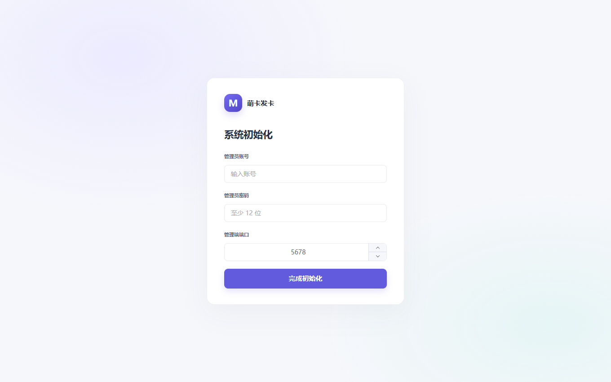
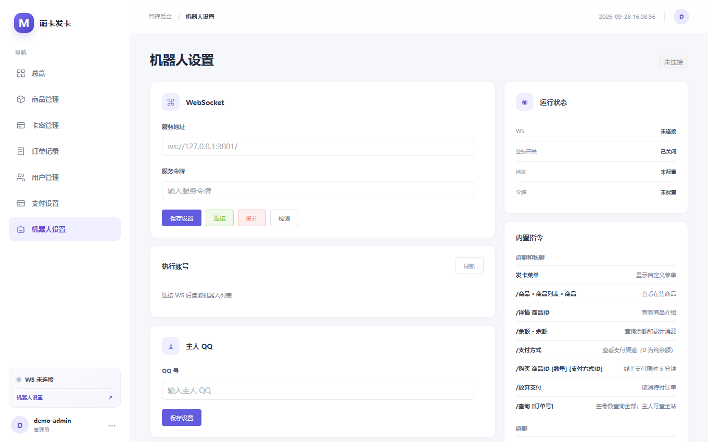
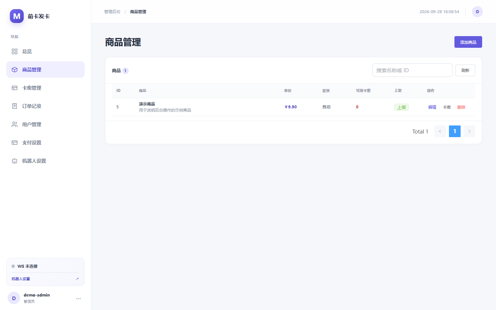
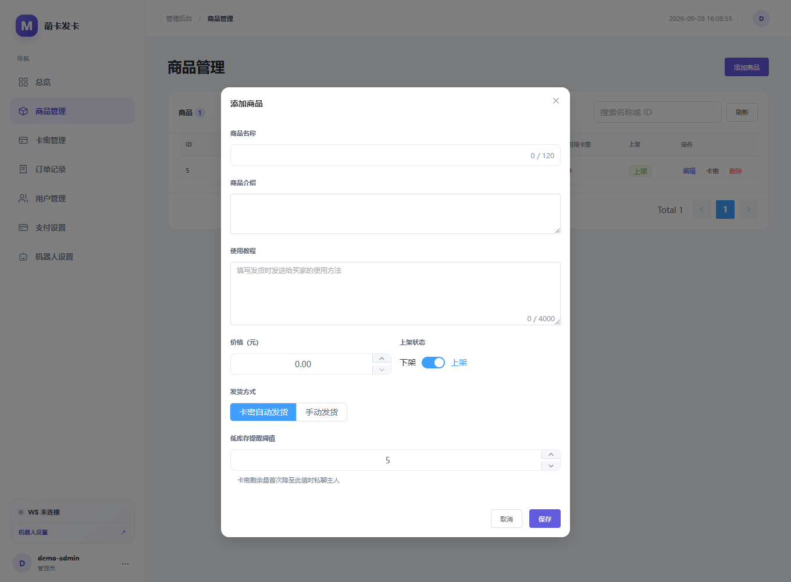
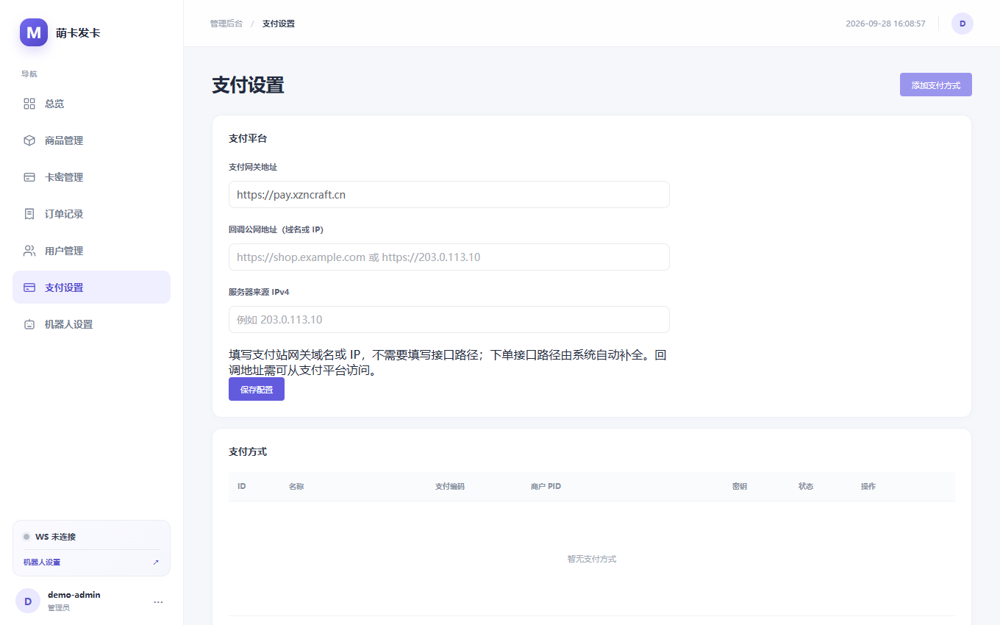

# 萌卡发卡使用教程

萌卡发卡是通过 QQ 机器人售卖数字商品的管理工具。本文面向使用 **1.0.0 版本包** 的管理员，按首次部署到日常处理订单的顺序说明操作。项目不公开源码；请以提供的版本包和对应版本说明为准。本 README 不授予开源许可。

本项目使用的机器人框架来源于 [Mengka-NT（Carlor-Official）](https://github.com/Carlor-Official/Mengka-NT)。

> 下方截图来自独立演示环境，账号、商品和页面状态均为示例，不包含真实用户、卡密、令牌或商户资料。不同版本的界面可能略有差异。

## 1. 解压并启动

1. 在 [1.0.0 版本目录](https://github.com/yuexl258/mengka-faka/tree/main/version/1.0.0) 下载对应系统的压缩包并解压到单独目录；也可从 `version/1.0.0/windows-amd64` 或 `version/1.0.0/linux-amd64` 获取程序。当前提供 Windows x64 和 Linux x64 版本，可用同目录的 `SHA256SUMS.txt` 校验下载文件。
2. 在程序所在目录启动服务。Windows 可双击 `mengka-faka.exe`，也可在 PowerShell 中执行 `.\mengka-faka.exe`；Linux 执行 `chmod +x mengka-faka && ./mengka-faka`。请保持程序运行；关闭终端或进程会停止管理端和机器人服务。
3. 首次在服务器本机浏览器打开 `http://localhost:5678`。设置管理员账号、至少 12 位的密码和管理端端口，点击“完成初始化”。程序会自动重启，浏览器将跳转到所选端口；若未自动跳转，请手动访问该端口并登录。

管理员账号长度为 3 至 32 个字符，密码长度为 12 至 256 个字符。后续启动会读取已保存的端口；忘记所选端口时，请检查启动日志或部署记录。管理端页面依赖浏览器访问 Vue 和 Element Plus 的 CDN，请确保浏览器能连接 `unpkg.com`。

默认数据库名为 `data.sqlite`，位于程序的**运行工作目录**。建议始终从同一目录启动，不要随意移动或覆盖数据库。需要指定数据库位置时，可在启动前设置 `DATABASE_PATH` 环境变量；需要临时覆盖监听地址时，可设置 `LISTEN_ADDR`。这两个变量通常不需要修改。

## 2. 连接萌卡 NT 机器人

1. 在萌卡 NT 后台创建正向 WebSocket 服务，取得服务地址和服务令牌。
2. 打开管理端“机器人设置”，填写“服务地址”和“服务令牌”，再填写主人 QQ，点击“保存设置”。令牌已配置后，输入框留空表示保留原令牌。
3. 点击“连接”并使用“检测”确认连接状态；在“执行账号”区域刷新列表，选择实际负责发卡的机器人 QQ。只有选中的账号收到的指令会触发回复。
4. 按需修改“自定义菜单”的触发词与回复内容并保存。业务开关可由主人 QQ 在群内发送 `/开机` 或 `/关机` 控制；当前群可用 `/群开` 或 `/群关` 控制。

若状态显示“已暂停”，点击“连接”恢复自动重连；“断开”会暂停自动重连。机器人账号无法选取时，先确认 WS 已连接，再刷新执行账号列表。

## 3. 添加商品并准备发货内容

在“商品管理”点击“添加商品”，填写名称、介绍、价格、使用教程、发货方式和上架状态。商品保存后会获得 ID，买家通过该 ID 下单。自动发货商品还可设置低库存提醒阈值；库存不高于阈值时，每次下单或库存检查都会尝试私聊主人 QQ，发送失败会保留提醒并重试。

- **卡密自动发货**：保存商品后进入“卡密管理” → “导入卡密”，选择商品并粘贴内容，**每行一条**。可用库存取决于未售卡密数量；卡密不足时无法正常发货。全站不允许重复卡密，已售卡密不能删除或再次分配。
- **手动发货**：可填写所有订单共用的默认发货内容，也可留空，待订单付款后为该订单单独填写。请在“订单记录”中确认发货。
- **使用教程**：买家下单时会把当时的教程保存到订单中，发货时连同卡密或手动内容私聊发送。以后编辑商品教程，不会改变旧订单的内容。

“卡密管理”支持按商品、状态查看记录和库存统计。将未售卡密人工标为“已售”会立即移出可售库存，且**无法撤销**；该操作不产生订单或销售额。

## 4. 配置支付

只使用余额支付时，可以暂不添加线上支付方式；余额不足的买家将无法下单。要启用线上支付，请在“支付设置”中：

1. 填写支付平台的**网关根地址**，不附加接口路径；填写支付平台可访问的**回调公网地址**（域名或 IP，建议 HTTPS，不附加路径、查询参数）；按支付平台要求填写本机对外的公网 IPv4。
2. 点击“保存配置”。再点击“添加支付方式”，填写名称、支付类型、商户 PID、商户密钥；渠道 ID 按支付平台要求填写或留空，最后启用并保存。
3. 用测试商品完成一笔小额支付，核对私聊付款链接、支付回调和订单状态后再正式营业。支付站的付款有效期也应设为 **5 分钟**。

支付方式 `0` 是纯余额支付；其他 ID 可通过机器人 `/支付方式` 查询。线上订单会先抵扣并预留可用余额，剩余金额通过支付平台付款，机器人私聊发送**付款链接**。同一 QQ 同时只能有一笔待付款订单；订单创建后 5 分钟到期，超时会取消并退还预留余额。若相同待付金额已被占用，系统可能给新订单增加少量金额用于区分付款，该金额不计入商品消费额。

**处理异常付款**：取消已经生成付款链接的订单前，先在支付平台核实是否收款。超时退款后才到达的有效回调会将订单标为“收款待核对”，不会自动发货；管理员须核对支付平台记录，再人工处理退款或交付。不要仅凭买家截图确认收款。

## 5. 买家下单与日常管理

常用机器人指令如下。方括号表示可选参数，发送时不要输入方括号。

| 指令 | 用途 |
| --- | --- |
| `发卡菜单`（或自定义触发词） | 查看菜单 |
| `/商品`、`/详情 商品ID` | 查看商品列表和介绍 |
| `/支付方式` | 查看已启用的支付方式 ID |
| `/购买 商品ID [数量] [支付方式ID]` | 创建订单，每次最多 10 件；省略支付方式时默认 `0`，即纯余额 |
| `/放弃支付` | 取消当前待付款订单 |
| `/查询 [订单号]` | 查看本人订单；不填订单号查询全部本人订单 |
| `/余额` | 查询余额和累计消费 |
| `/签到` | 群内每日签到，需管理员先启用 |

主人 QQ 使用 `/查询` 可查询全站订单。群内查询订单时，订单结果会私聊发送，避免把卡密发到群里。请确保买家允许机器人私聊。

在“订单记录”可查看状态和付款、发货详情：

- “待付款”：等待付款或人工核实；如需取消，先核对支付平台是否已收款。
- “已付款待发货”：付款已确认但尚未完成发货，核对后点击“确认发货”。
- “已发货”但“私聊通知”显示“待重试”：卡密已分配，不要再次手工分配；检查私聊条件后点击“重试通知”。
- “收款待核对”：按上一节的异常付款流程处理，不会自动发货。

“用户管理”可查看余额流水、带原因调整余额，并设置每日签到赠送范围，金额单位是**分**。签到默认关闭；同一 QQ 按北京时间每天只能签到一次，所有群共享次数。

## 6. 备份、更新与安全

更新 version 包前，先停止服务并备份 `data.sqlite`，再替换程序文件；**不要用新包覆盖数据库**。首次使用新版本时先在备份环境验证启动、登录和下单流程。数据库包含管理员配置、商户凭据、用户余额、订单及卡密，请限制文件访问权限，不要把它、备份或运行日志随截图公开。

对公网提供支付回调时，使用可访问的 HTTPS 地址并正确配置反向代理、防火墙和回调路由。管理端应只向受信任的管理员开放。修改管理员账号或密码后，所有会话会失效，需要重新登录。
